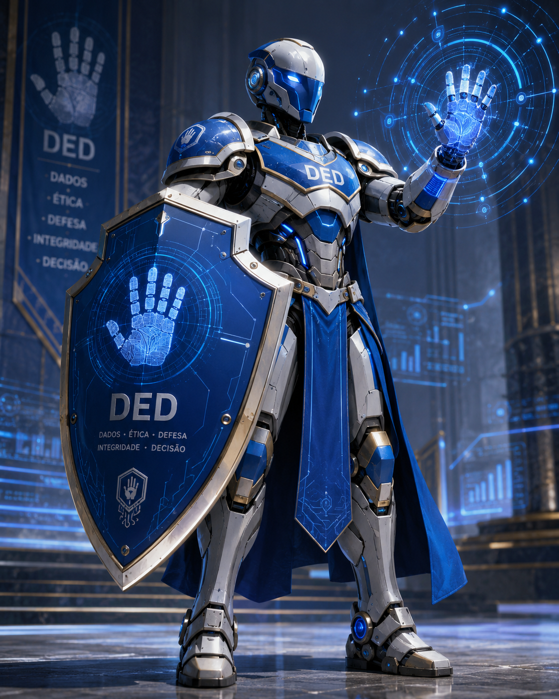

<div align="center">



# DED

**D**ados · **É**tica · **D**efesa · **I**ntegridade · **D**ecisão

Um paladino de mesa para D&D 2024, em português.

[English](README.en.md) · [Base de regras](docs/README.md) · [Guia para agentes](AGENTS.md)

</div>

---

## O que é

Um ambiente onde um agente de IA conduz você pelo D&D 2024: cria personagem, transforma uma
ideia solta em ficha jogável, planeja campanha e conduz a mesa. As regras vêm do livro, com
a página citada. Quando o agente não acha a regra, ele diz que não achou, em vez de inventar.

Feito com modelos gratuitos, via [opencode](https://opencode.ai). A ideia é essa: quem quer
jogar D&D não deveria precisar pagar assinatura de IA nem decorar 397 páginas para começar.

## O que dá para fazer

| Você quer | Diga | O que acontece |
|---|---|---|
| Um personagem novo | `/criar-personagem` | Os 5 passos oficiais, e no fim uma ficha que passa no validador |
| Uma ideia virar personagem | `/gerar-historia` | O passado sai ancorado no multiverso e vira escolha de perícia, talento e magia |
| Saber uma regra | `/consultar-regra` | Resposta com a citação de onde ela está |
| Planejar a evolução | `/planejar-build` | Nível a nível, com número onde dá para medir |
| Mestrar | `/mestrar` | Encaminha para a altura certa: campanha, aventura, sessão ou mesa |

## O circuito de Mestre

Planejar mesa erra quando se trabalha na escala errada: detalhar a taverna da sessão 1 antes
de saber do que a campanha trata. O circuito existe para manter cada decisão na sua altura.

```
   /planejar-campanha        premissa, tom, facções, onde termina
            │
            ▼
   /planejar-aventura  ◄──────────────┐        o problema e quem o causa
            │                         │
            ▼                         │
   /planejar-sessao                   │        as cenas do próximo encontro
            │                         │
            ▼                         │
        /mesa                         │        o jogo acontecendo
            │                         │
            ▼                         │
     /pos-sessao ─────────────────────┘        o que mudou realimenta o plano
```

Componentes que qualquer altura chama: `/montar-encontro`, `/criar-pnj`, `/criar-local`,
`/gerar-eventos`.

O circuito fecha de propósito. Planejamento que não recebe o resultado da mesa vira ficção
paralela ao jogo real.

## Como a base de regras é feita

O livro é diagramado com uma fonte por papel semântico, então o extrator decide o que é
título, tabela ou corpo pela **tipografia**, não por adivinhação sobre o texto:

| Fonte no PDF | Papel |
|---|---|
| `WolpePegasus 64pt` | Nome de classe |
| `MrsEavesOT-Roman 12pt` | Nome de magia |
| `TTJenevers-BoldItalic 9pt` | Título embutido no parágrafo |
| `ScalaSans-BoldLF 9pt` | Rótulo de célula de tabela |

Isso torna a extração verificável por contagem. Se o sumário promete 48 subclasses e saem 47,
o defeito se anuncia sozinho:

```
classes .......... 12    bate com o sumário
subclasses ....... 48    4 por classe
magias ........... 391   zero inversões alfabéticas
condições ........ 15    uma ocorrência cada
progressão ....... 20 níveis × 6 colunas, largura uniforme
```

A ordem alfabética das magias é o oráculo mais útil de todos: qualquer inversão significa que
o fluxo de leitura entre as duas colunas quebrou, e que texto pode ter caído sob o nome errado.

## Começar

Você precisa do seu exemplar do Livro do Jogador (2024) em PDF, na raiz do projeto.

```bash
pip install --user pymupdf
python3 tools/gerar_docs.py todos      # gera docs/ a partir do seu PDF
```

Depois é só pedir. Para conferir uma ficha a qualquer momento:

```bash
python3 tools/validar_ficha.py fichas/exemplo-thorin.json
```

O validador confere o que é decidível por cálculo: bônus de proficiência pelo nível, PV
possível para o dado de vida e a Constituição, teto dos 27 pontos na compra de atributos.

## O que tem aqui

```
tools/           extrair.py, gerar_docs.py, validar_ficha.py
.claude/skills/  as 15 skills
docs/            a base de regras (gerada do seu PDF, não versionada)
fichas/          personagens em JSON
mesa/            sua campanha (criada quando você começa a mestrar)
```

## Sobre o livro

Este repositório não distribui o Livro do Jogador. O `docs/` é gerado do **seu** exemplar e
fica fora do controle de versão. Dungeons & Dragons e o Livro do Jogador pertencem à Wizards
of the Coast; a tradução brasileira usada é a da equipe Heróis Anônimos.

As ferramentas e as skills são livres para usar e modificar.
