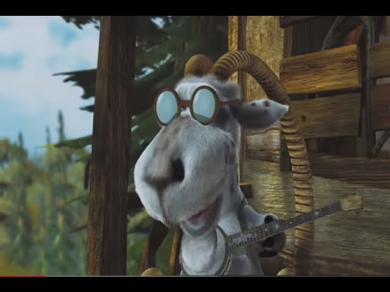
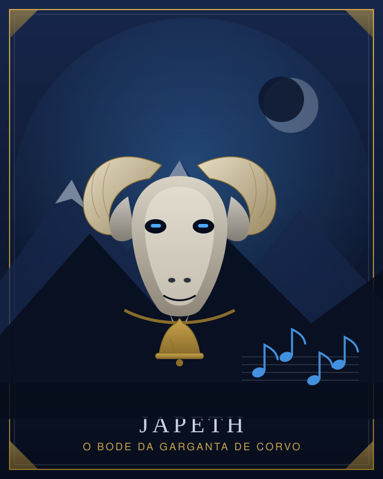

# Exemplo — "o bode que só fala cantando"

<table>
<tr>
<td width="50%" align="center"><br><sub><b>Entrou:</b> a referência —
<a href="https://pt.wikipedia.org/wiki/Deu_a_Louca_na_Chapeuzinho">Japeth, de <i>Deu a Louca na Chapeuzinho</i></a></sub></td>
<td width="50%" align="center"><br><sub><b>Saiu:</b> Japeth, o bode da Garganta de Corvo</sub></td>
</tr>
</table>

Skill: `/criar-pnj`. O que este exemplo mostra: usar o limite honesto do projeto. Não existe
bestiário aqui, então o bloco vem do apêndice B do Livro do Jogador e tudo que ele não cobre
sai marcado como adaptação do Mestre — nunca como regra.

---

## Você diz

```
/criar-pnj quero o bode do Deu a Louca na Chapeuzinho: mora na montanha,
sabe o caminho, e só consegue se comunicar cantando
```

## O agente responde

> O que eu vou usar do pedido é o **comportamento**: bode de montanha, falante, e uma maldição
> que o obriga a cantar tudo. O resto vem do mundo do jogo. Um traço de fala executável como
> esse vale mais que um parágrafo de personalidade, porque funciona também nas cenas que você
> não previu.

### O PNJ

> **Japeth**, o bode da Garganta de Corvo
>
> Bode de chifres lascados, pelo cinza sujo de poeira de mina, com uma sineta de latão amassada
> no pescoço.
>
> **O que quer.** Voltar a falar. Era pastor na encosta, e negou pousada a uma bruxa numa noite
> de nevasca; ela o pôs no corpo do bode que dormia no curral que ele havia negado, e amarrou a
> voz dele ao canto. Hoje guia qualquer um que suba a montanha, na esperança de encontrar
> alguém que saiba desfazer a maldição.
>
> **Como fala.** Canta. Toda resposta é cantada, em ópera de taverna, com rima forçada quando
> a rima não vem. **Desafina quando mente** — e é isso que o torna útil em mesa: os jogadores
> aprendem a ouvir o desafino, e você tem um detector de mentira que não exige rolagem.
>
> **O que sabe.** A passagem por trás da cascata, que corta dois dias de viagem, e o motivo de
> os mineradores terem parado de usá-la. A passagem ele conta de graça; o motivo, só depois que
> alguém cantar de volta para ele. Não é preço, é solidão.
>
> **Atitude inicial: Amigável** (`docs/regras/glossario.md`, p. 360–377). O grupo tem Vantagem
> nos testes para Influenciá-lo. Vira Indiferente se rirem dele: ninguém continua Amigável
> sendo tratado como piada.

### As estatísticas, e o que nelas é meu

> Bloco base: **Cabra Gigante**, `docs/apendices/criaturas.md`, p. 346–359.
>
> | | |
> |---|---|
> | Fera Grande, Sem Alinhamento | ND 1/2 (XP 100; BP +2) |
> | CA 11 | PV 19 (3d10 + 3) |
> | Deslocamento 12 m, Escalada 9 m | Percepção +3, Visão no Escuro 18 m, PP 13 |
> | For 17 (+3), Des 13 (+1), Con 12 (+1) | Int 3 (–4), Sab 12 (+1), Car 6 (–2) |
> | **Cabeçada Aríete.** Ataque corpo a corpo +5, alcance 1,5 m, 6 (1d6+3) Contundente. Se moveu 6 m em linha reta antes, +5 (2d4) e o alvo Grande ou menor fica **Caído**. | |
>
> **Adaptação declarada, e é adaptação minha, não regra:**
>
> - O bloco lista **Idiomas —**. Japeth entende e canta em Comum porque foi humano; isso é
>   decisão sua como Mestre, e não sai do apêndice.
> - **Int 3** é de cabra. Se ele guarda a mente do pastor, suba a Inteligência para 10 (+0) e o
>   Carisma para 11 (+0) — o apêndice já autoriza o Mestre a alterar detalhes do bloco. Se você
>   preferir que a maldição tenha custado a mente junto com a voz, deixe o 3: aí ele guia por
>   instinto, e não por memória.
> - A maldição em si não tem regra em `docs/`: aqui só há o Livro do Jogador, e remover
>   maldição de humanoide transformado é assunto do Mestre. Se algum personagem tentar
>   desfazê-la, arbitre — não finja que existe uma linha que resolve.

### Ganchos

> - A bruxa continua na montanha, e sabe que alguém está subindo com o bode.
> - Os mineradores fecharam a passagem por causa de algo, e Japeth viu o quê.
> - Se o grupo o desencantar, você ganha um pastor que deve a vida a eles — e perde o bode de
>   que a mesa passou a gostar. Deixe a escolha na mão deles.
>
> Ele vai voltar em outras sessões? Se sim, gravo em `mesa/pnjs/japeth.md`. Se for só desta
> sessão, fica na anotação dela, e eu promovo depois, caso o grupo se importe.

### A nota de imersão

> Nada na resposta acima cita o desenho. O bode que canta virou um pastor amaldiçoado numa
> montanha com passagem escondida, e a piada de cantar virou **mecânica de mesa** pelo
> desafino. O teste é esse: tire a referência do pedido, e o PNJ continua de pé.
