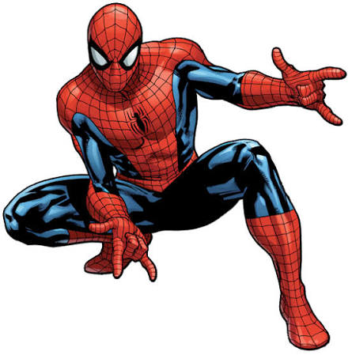
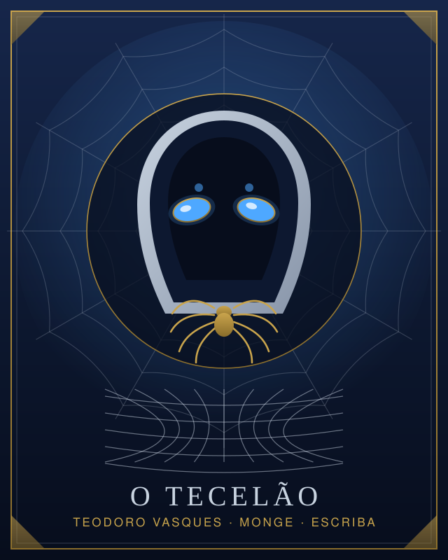

# Exemplo — "quero jogar o Homem-Aranha"

<table>
<tr>
<td width="50%" align="center"><br><sub><b>Entrou:</b> a referência —
<a href="https://pt.wikipedia.org/wiki/Homem-Aranha">Homem-Aranha</a></sub></td>
<td width="50%" align="center"><br><sub><b>Saiu:</b> Teodoro Vasques, o Tecelão</sub></td>
</tr>
</table>

Skill: `/criar-personagem`. O que este exemplo mostra: traduzir um herói de fora da mesa em
ficha de D&D 2024 sem citar o herói no resultado, e sem inventar regra para imitá-lo.

---

## Você diz

```
/criar-personagem quero jogar o Homem-Aranha
```

## O agente responde

> Dá para fazer, e não como piada: o conceito é limpo de traduzir. Antes de escolher classe,
> vou separar o que é **poder** do que é **nome**. O nome fica de fora da mesa; os poderes eu
> procuro em `docs/`, um por um. O que eu não achar, eu digo que não achei.
>
> Três coisas em um lote, e sigo com o que você não responder:
>
> 1. Nível inicial? (assumo 1, com o caminho até o 4 desenhado)
> 2. O grupo já existe? (assumo grupo novo)
> 3. Ele é herói urbano de rua, ou você quer o conceito solto em qualquer cenário?
>    (assumo herói de cidade)

### O mapa: poder → mecânica

| O que ele faz | Como isso existe em 2024 | Onde |
|---|---|---|
| Anda em parede e teto | Monge, **Movimento Acrobático** (nível 9): move-se por superfícies verticais no próprio turno sem cair | `docs/classes/monge.md`, p. 159–165 |
| Anda em parede *antes* do nível 9 | Talento **Atleta** (nível 4+, For ou Des 13+): Deslocamento de Escalada igual ao Deslocamento | `docs/talentos/talentos.md`, p. 199–211 |
| Prende o inimigo com teia | **Rede** (1 PO): na ação Atacar, substitui um ataque; alvo salva Destreza CD 8 + mod Des + BP ou fica **Contido** | `docs/equipamento/equipamento.md`, p. 213–233 |
| Sentido de perigo | Talento **Alerta**: Bônus de Proficiência na Iniciativa, e troca de Iniciativa com um aliado | `docs/talentos/talentos.md`, p. 199–211 |
| Desviar no ar do que vem | Monge, **Defletir Ataques** (nível 3): Reação reduz o dano em 1d10 + mod Des + nível de Monge, e por 1 Ponto de Foco redireciona a força para outro alvo | `docs/classes/monge.md` |
| Cair de prédio e levantar | Monge, **Queda Lenta** (nível 4): Reação reduz o dano da queda em 5 × nível de Monge | `docs/classes/monge.md` |
| Bater sem arma, rápido | Monge, **Artes Marciais** (nível 1): Ataque Desarmado como Ação Bônus, 1d6, e ataque com Destreza | `docs/classes/monge.md` |
| Empurra, derruba, desarma | Subclasse **Combatente da Mão Espalmada** (nível 3): Derrubar, Desorientar ou Empurrar 4,5 m ao acertar com a Torrente de Golpes | `docs/classes/monge.md` |
| O cientista por trás da máscara | Antecedente **Escriba**: Destreza, Inteligência, Sabedoria; talento Habilidoso; Investigação e Percepção | `docs/especies/antecedentes.md`, p. 177–185 |

> **Duas observações honestas**, antes de você aprovar:
>
> - A **Rede** não é arma no material de 2024: está em Equipamento de Aventura, não usa jogada
>   de ataque e alcança 4,5 metros. Ela prende, não balança ninguém pela cidade.
> - A magia **Teia** existe (2º Círculo, Invocação, Cubo de 6 m, `docs/magias/descricoes.md`),
>   mas é lista de Feiticeiro e Mago. Monge não conjura, então ela só entra se você aceitar
>   multiclasse — e aí o personagem vira outro. Minha recomendação é ficar com a Rede e
>   descrever o efeito como teia na narração: a mecânica é a mesma, e a ficha continua limpa.

### A ficha, nível 1

> **Teodoro Vasques**, o **Tecelão** — Humano, Monge nível 1, antecedente Escriba.
>
> | Campo | Valor | De onde vem |
> |---|---|---|
> | Atributos (Custo de Pontos, 27) | Des 15, Sab 14, Con 13, Int 12, For 10, Car 8 | `docs/personagem/criacao.md` |
> | Depois dos aumentos do Escriba (+2 Des, +1 Int) | **Des 17 (+3)**, Sab 14 (+2), Con 13 (+1), Int 13 (+1), For 10 (+0), Car 8 (–1) | `docs/especies/antecedentes.md` |
> | PV | 9 (dado d8 + Con) | `docs/classes/monge.md` |
> | CA | **15** = 10 + Des + Sab, Defesa sem Armadura | `docs/classes/monge.md` |
> | Espécie | Humano: Eficiente, Hábil (1 perícia), **Versátil → talento Alerta** | `docs/especies/especies.md` |
> | Talento de origem | Habilidoso, do Escriba: 3 perícias ou ferramentas | `docs/talentos/talentos.md` |
> | Perícias | Investigação, Percepção (Escriba) + Acrobacia, Furtividade (Monge) + Atletismo, Intuição, Suprimentos de Calígrafo (Habilidoso) + 1 do Hábil | — |
> | Equipamento notável | **3 Redes** (1 PO cada), Corda, Suprimentos de Calígrafo | `docs/equipamento/equipamento.md` |
>
> Conferido à mão: 15+14+13+12+10+8 custa exatamente 27 pontos, e o teto de 15 vale **antes**
> dos aumentos do antecedente, por isso a Destreza 17 é legal.
>
> O caminho: nível 3 entra Defletir Ataques e a Mão Espalmada; nível 4 é onde eu recomendo
> **Atleta** em vez de aumento de atributo, porque é ele que dá a escalada cinco níveis antes
> do Monge; nível 9 a escalada vira andar em parede sem custo.

### O nome no mundo

> "Homem-Aranha" não vai à mesa. O que vai é isto: Teodoro perdeu o tio numa emboscada da
> Guilda dos Fiadores, no bairro dos tecelões, e passou a caçar a guilda de máscara, usando
> contra ela a rede que ela mesma fabrica. Trabalha de copista de dia, porque é o emprego que
> lhe dá acesso aos registros da guilda.
>
> É a mesma história, com nomes que existem no mundo. Ninguém na mesa precisa ter lido
> quadrinho para entender quem ele é.

### O que ficou de fora

> - **Balançar por teia entre prédios** não tem mecânica: a Rede alcança 4,5 metros e prende.
>   Isso é ficção de mesa, e quem decide se rola é o Mestre. Nada em `docs/` concede.
> - **Grudar no teto parado** não é o que o Movimento Acrobático diz: ele funciona no seu
>   turno, durante o movimento. Ficar pendurado é conversa com o Mestre.
>
> Fecho no passo 5 com `gerar-historia`, para amarrar a Guilda dos Fiadores a uma facção da
> campanha e devolver ganchos ao Mestre. Quer que eu siga, ou prefere ajustar o mapa antes?
